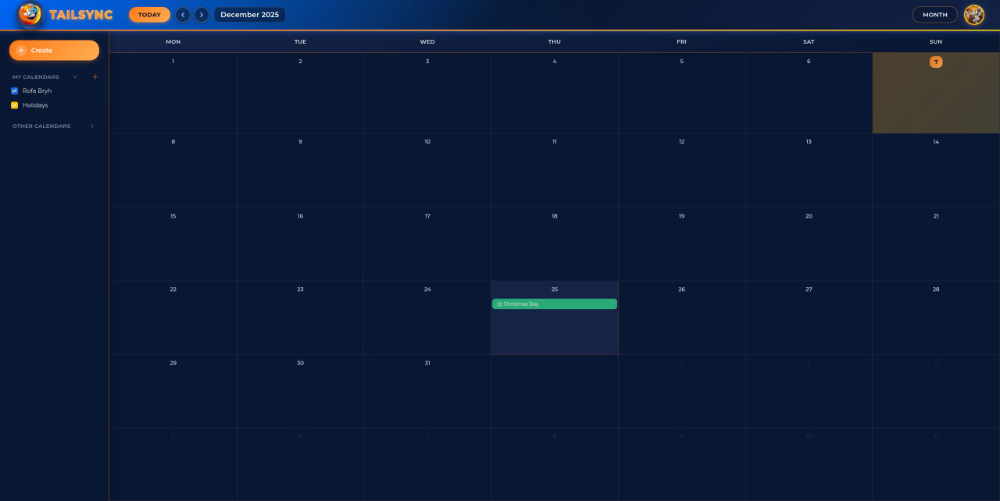
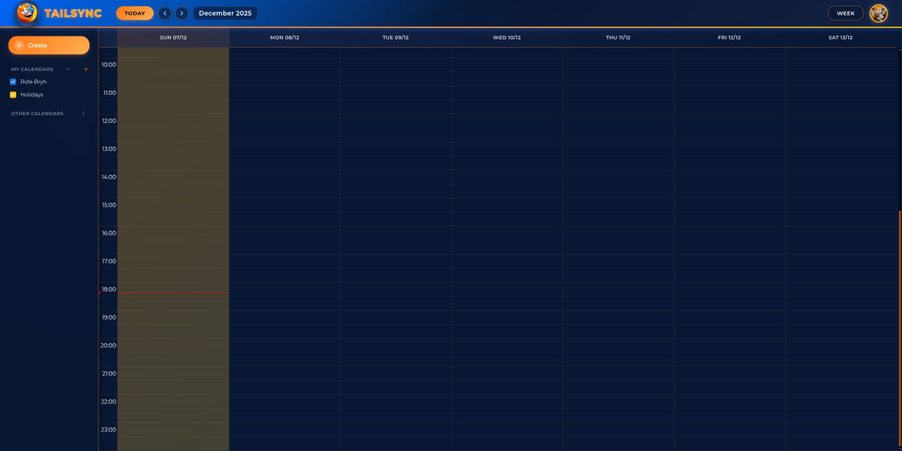
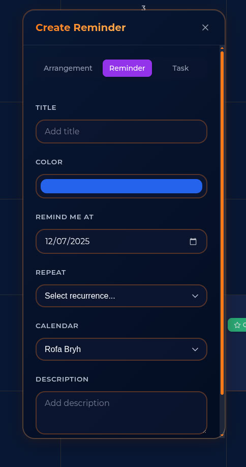
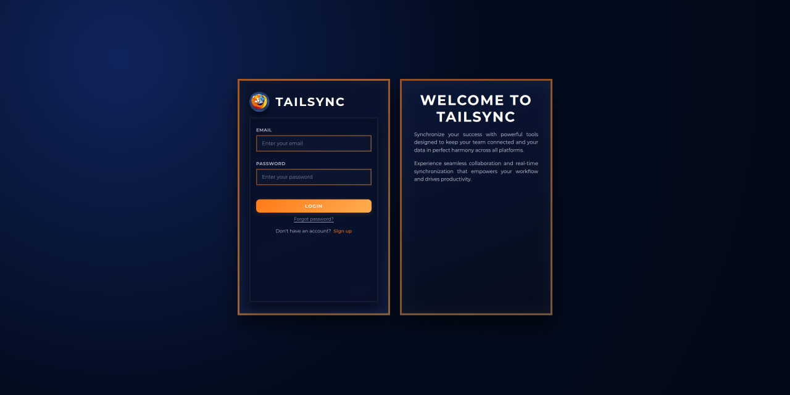

# TailSync

A modern, collaborative calendar application built with React that enables users to manage their schedules, create events, and share calendars with others.

## Description

TailSync is a feature-rich calendar management system that allows users to:

- **Manage Personal Schedules**: Create and organize different types of events including arrangements, reminders, tasks, and holidays
- **Multiple Calendar Views**: Switch between day, week, month, and year views to visualize your schedule
- **Collaborative Calendars**: Share calendars with other users and collaborate on events
- **Event Recurrence**: Set up recurring events with flexible scheduling options
- **User Authentication**: Secure login system with password reset functionality

## Documentation

For comprehensive documentation including detailed algorithms, system architecture, CBL stage progress, and technical implementation details, please see:

**[Full Documentation](./docs/DOCUMENTATION.md)**

The documentation includes:
- Complete CBL (Challenge-Based Learning) stage progress
- Detailed system architecture and design decisions
- Algorithm descriptions with flowcharts
- Technical implementation guides
- API integration details
- Component structure and data flow
- Future roadmap and improvements

## Screenshots

### Calendar Month View


### Calendar Week View


### Event Creation


### Authentication


## Requirements and Dependencies

### Prerequisites

Before running this project, ensure you have one of the following setups:

#### Option 1: Local Development
- **Node.js**: v18.0.0 or higher (tested with v22.16.0)
- **npm**: v9.0.0 or higher (tested with v11.5.2)

#### Option 2: Docker
- **Docker**: v20.10.0 or higher
- **Docker Compose** (optional): v2.0.0 or higher

#### Required for Both Options
- **Backend API**: TailSync requires a running backend server (default: `http://localhost:8080`)

### Main Dependencies

This project uses the following key technologies:

- **React**: v19.1.1 - UI framework
- **Vite**: v7.1.7 - Build tool and dev server
- **React Router DOM**: v7.9.5 - Client-side routing
- **FullCalendar**: v6.1.19 - Calendar component library
- **Axios**: v1.13.2 - HTTP client for API requests
- **React Hot Toast**: v2.6.0 - Notification system

### Development Dependencies

- **ESLint**: v9.36.0 - Code linting
- **@vitejs/plugin-react**: v5.0.4 - Vite plugin for React support
- TypeScript types for React and React DOM

## How to Run Your Solution

Follow these steps to get TailSync running on your local machine:

### 1. Clone the Repository

```bash
git clone <your-repository-url>
cd tailsync-ui
```

### 2. Install Dependencies

```bash
npm install
```

This will install all required packages listed in `package.json`.

### 3. Configure Environment Variables

Create a `.env` file in the root directory by copying the example file:

```bash
cp .env.example .env
```

Edit the `.env` file to set your backend API URL:

```env
VITE_API_URL=http://localhost:8080
```

> **Important**: Make sure your backend API is running at the specified URL before starting the frontend.

### 4. Start the Development Server

```bash
npm run dev
```

This will start the Vite development server. The application will be available at:

```
http://localhost:5173
```

The development server includes:
- Hot Module Replacement (HMR) for instant updates
- Fast refresh for React components
- Detailed error messages

### 5. Build for Production (Optional)

To create a production-optimized build:

```bash
npm run build
```

## Running with Docker

As an alternative to local installation, you can run TailSync using Docker:

### Prerequisites for Docker

- **Docker**: v20.10.0 or higher
- **Docker Compose**: v2.0.0 or higher

### Using Docker

#### 1. Configure Environment Variables

Create a `.env` file as described in step 3 above:

```bash
cp .env.example .env
```

Edit the `.env` file. If running the backend in Docker as well, use the appropriate network URL:

```env
VITE_API_URL=http://localhost:8080
```

#### 2. Build the Docker Image

```bash
docker build -t tailsync-ui .
```

#### 3. Run the Docker Container

```bash
docker run -p 5173:5173 --env-file .env tailsync-ui
```

The application will be available at `http://localhost:5173`

### Docker Notes

- The Dockerfile uses Node.js 22 Alpine for a lightweight image
- The development server runs with `--host` flag to allow external access
- Port 5173 is exposed for the Vite dev server
- Environment variables are loaded from the `.env` file

## Additional Commands

- **Lint Code**: `npm run lint` - Check code quality and style issues
- **Development Mode**: `npm run dev` - Start development server with HMR
- **Production Build**: `npm run build` - Create optimized production bundle
- **Preview Build**: `npm run preview` - Preview production build locally

## Project Structure

```
tailsync-ui/
├── docs/               # Documentation
│   ├── DOCUMENTATION.md    # Full project documentation
│   └── screenshots/        # Application screenshots
├── public/             # Static assets
├── src/
│   ├── components/     # Reusable UI components
│   ├── context/        # React context providers
│   ├── hooks/          # Custom React hooks
│   ├── layouts/        # Page layouts
│   ├── pages/          # Page components
│   ├── services/       # API service modules
│   ├── shared/         # Shared utilities and components
│   ├── utils/          # Utility functions
│   ├── App.jsx         # Main application component
│   └── main.jsx        # Application entry point
├── .dockerignore       # Docker ignore file
├── .env.example        # Example environment variables
├── Dockerfile          # Docker configuration
├── package.json        # Project dependencies
├── README.md           # This file
└── vite.config.js      # Vite configuration
```

## Features

- **User Management**: Registration, login, password reset, and profile management
- **Calendar Types**: Support for multiple event types (arrangements, reminders, tasks, holidays)
- **View Options**: Day, week, month, and year calendar views
- **Event Management**: Create, edit, delete, and view event details
- **Recurring Events**: Set up events with recurrence rules
- **Calendar Sharing**: Share calendars with other users via invite links
- **Drag & Drop**: Rearrange events by dragging them on the calendar
- **Real-time Updates**: Toast notifications for user actions and updates

## License

This project is part of an academic assignment for the LMS/Uchronos course.

---

**Built with React, Vite, and FullCalendar**